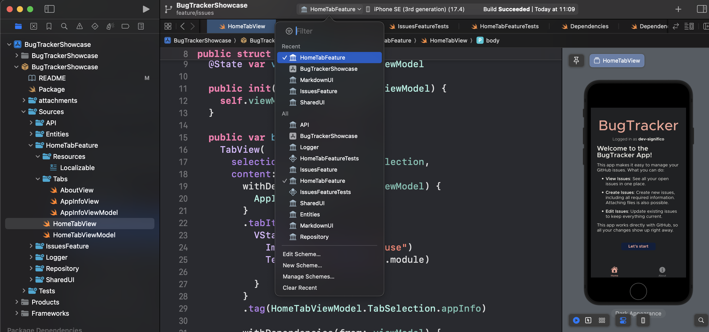
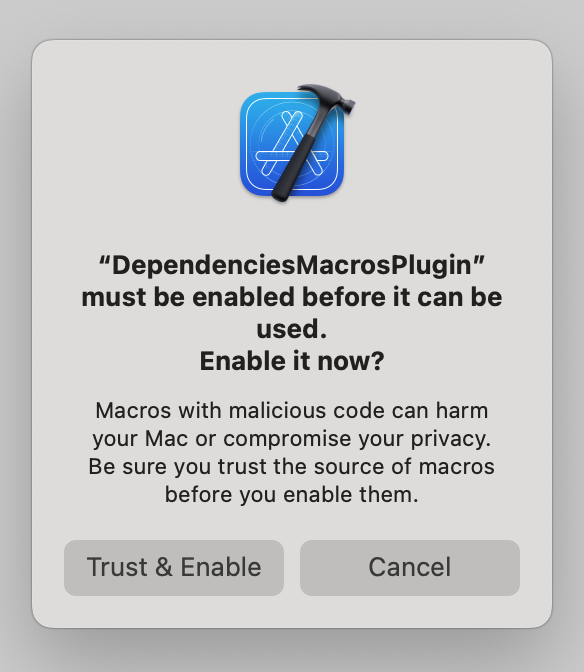

## Project Overview

This project is an iOS showcase app, designed to demonstrate the use of modern iOS development techniques and architectural patterns. The project is written entirely in [Swift](https://swift.org/), adhering to best practices in iOS development.

### Key Technologies

- **[Swift Package Manager](https://www.swift.org/documentation/package-manager/)**: Used to drive the multi module architecture and handle dependencies.
- **[Xcode](https://developer.apple.com/xcode/)**: The development environment used for building and testing the application.
- **[SwiftUI](https://developer.apple.com/xcode/swiftui/)**: Utilized for building declarative UIs, allowing for more intuitive and responsive design.
- **[Swift Concurrency](https://docs.swift.org/swift-book/documentation/the-swift-programming-language/concurrency/)**: Employed to manage asynchronous tasks in a more readable and efficient manner, making code easier to reason about and less prone to errors.
- **[Combine](https://developer.apple.com/documentation/combine)**: Integrated for managing event-driven code, although Swift Concurrency is predominantly used.
- **[OSLog](https://developer.apple.com/documentation/os/logging)**: Used for logging and diagnostics, providing detailed insights during development and debugging.

## Requirements

To set up and run the project, ensure you meet the following requirements:

- **Development Environment**: Use at least Xcode 15, which supports Swift 5.10 and iOS 17.
- **iOS Compatibility**: The application is compatible with devices running iOS 17 or later.
- **GitHub Personal Access Token (PAT)**: To run the project, create a `.env` file in the `Sources/API/` directory with the following content:
    ```
    GITHUB_TOKEN={pat}
    ```

This `GITHUB_TOKEN` refers to a personal GitHub access token with permissions to create and update issues. The required token will be provided upon request by Significo. Please contact us at dev@significo.com to obtain the necessary token.

For more information on GitHub PATs, refer to the [GitHub documentation on granular PATs](https://docs.github.com/en/authentication/keeping-your-account-and-data-secure/creating-a-personal-access-token).

## Multi module approach

The app follows a multi-module approach, relaying on Swift Package Manager the handling and creation of those packages. The idea is to:

- be able to have a smooth separation of concerns between features that allows developers to easily add, change, remove or even test code in an independent manner. 
- to painlessly add or remove files without triggering modifications of the .xcodeproj.
- heavily depend upon Xcode Previews to be able to independently run features or even the whole app.
- modify as little as possible the app target.
    
### Creating a new module

To create a new module, first create the file structure and then modify Package.swift accordingly. Be sure to add dependencies between modules, be it external or internal ones.

### Caveats 

- __You must open the Xcode project, do not open the swift package.__

- You should add any assets to the Resources package, from there you can use them wherever you want.

- You will have to build and select the appropiate module once you decide you want to begin using live previews. This can be easily done by pressing control+0 on Xcode and selecting the desired module. 



- Please make sure you trust the `DependenciesMacrosPlugin`, your previews may not work if you don't do this.



## Showcase App

This application provides an efficient way to manage your GitHub issues, leveraging the [GitHub API](https://docs.github.com/en/rest/repos/contents?apiVersion=2022-11-28).

### Technical Features:

- **View Issues**: Demonstrates how to fetch data using GET operations from the GitHub API. This feature retrieves and displays all open issues in one centralized location, showcasing effective data fetching and UI integration.
- **Create Issues**: Illustrates the use of POST and PUT operations to create new issues on GitHub. This includes providing all necessary information and the ability to attach files, such as PDFs and images, highlighting file upload capabilities within API interactions.
- **Edit Issues**: Showcases the use of PATCH operations to update existing issues. This feature ensures that issue data can be modified and kept current, demonstrating efficient data update mechanisms and synchronization with GitHub.

By working directly with GitHub, this app ensures that all changes are reflected immediately, maintaining real-time synchronization with your repositories.

### Accessibility

This application is designed with accessibility in mind, supporting VoiceOver and featuring user-friendly UI components, content descriptions, and compliance with [accessibility guidelines](https://developer.apple.com/accessibility/ios/) to ensure a seamless experience for all users.

## Dependencies

The project leverages the following dependencies to enhance functionality and maintainability:

- **[Alamofire](https://github.com/Alamofire/Alamofire)**: For HTTP networking and handling requests.
- **[swift-dependencies](https://github.com/pointfreeco/swift-dependencies)**: For dependency injection and improving code modularity.
- **[swift-navigation](https://github.com/pointfreeco/swift-navigation)**: For managing navigation within the app.
- **[MarkdownUI](https://github.com/gonzalezreal/swift-markdown-ui)**: For rendering and displaying Markdown content.
- **[swift-dotenv](https://github.com/thebarndog/swift-dotenv.git)**: For managing environment variables, including the GitHub PAT.
- **[swift-log](https://github.com/apple/swift-log)** and **[swift-log-oslog](https://github.com/chrisaljoudi/swift-log-oslog)**: For logging and diagnostics within the app.
- **[swift-format](https://github.com/swiftlang/swift-format)**: Official apple formatting technology for Swift.
